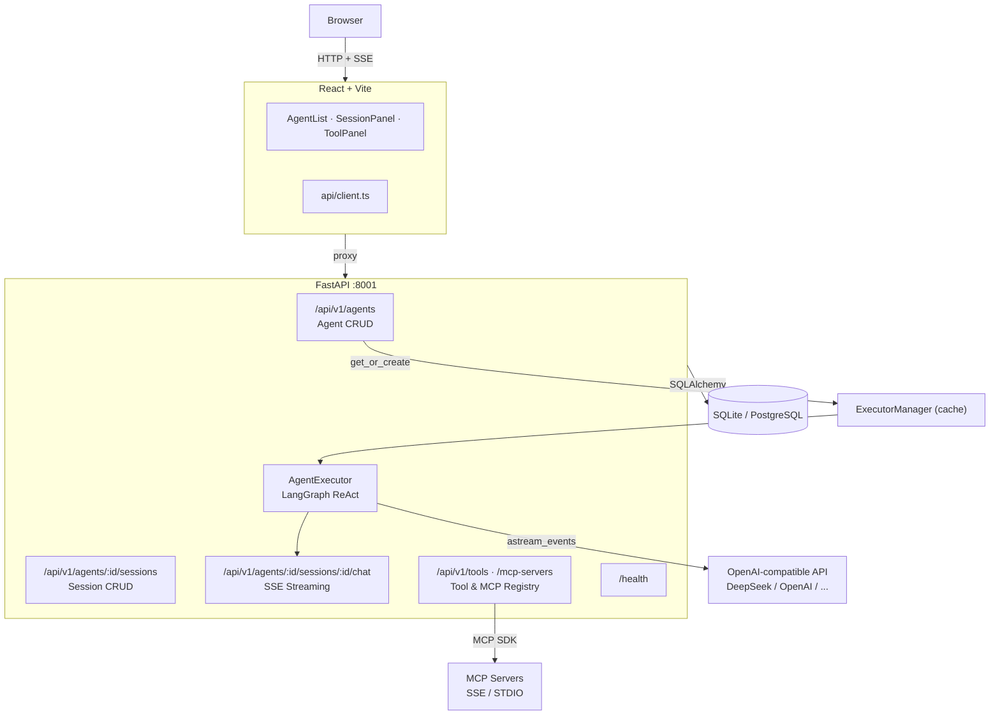
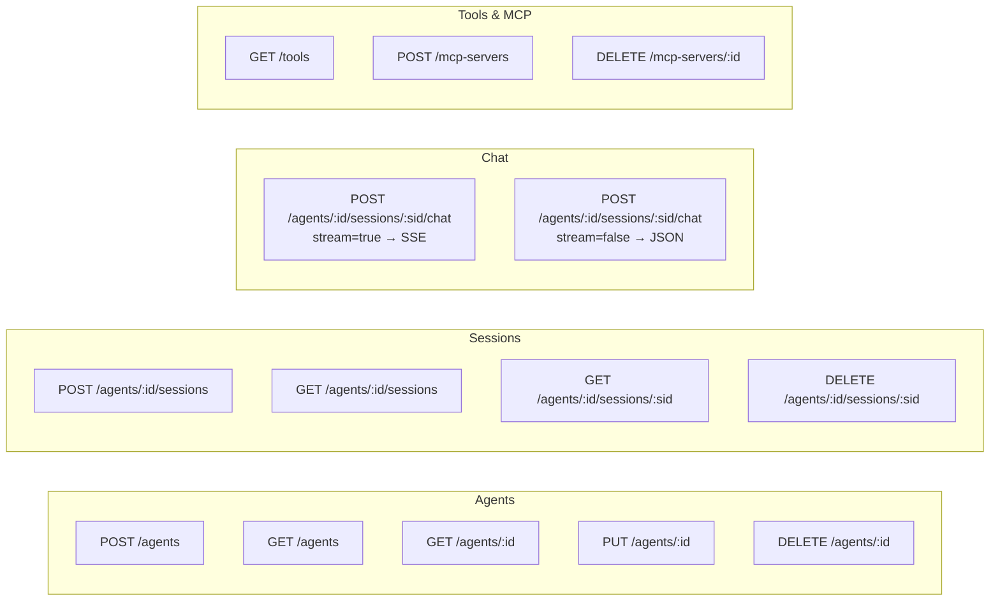
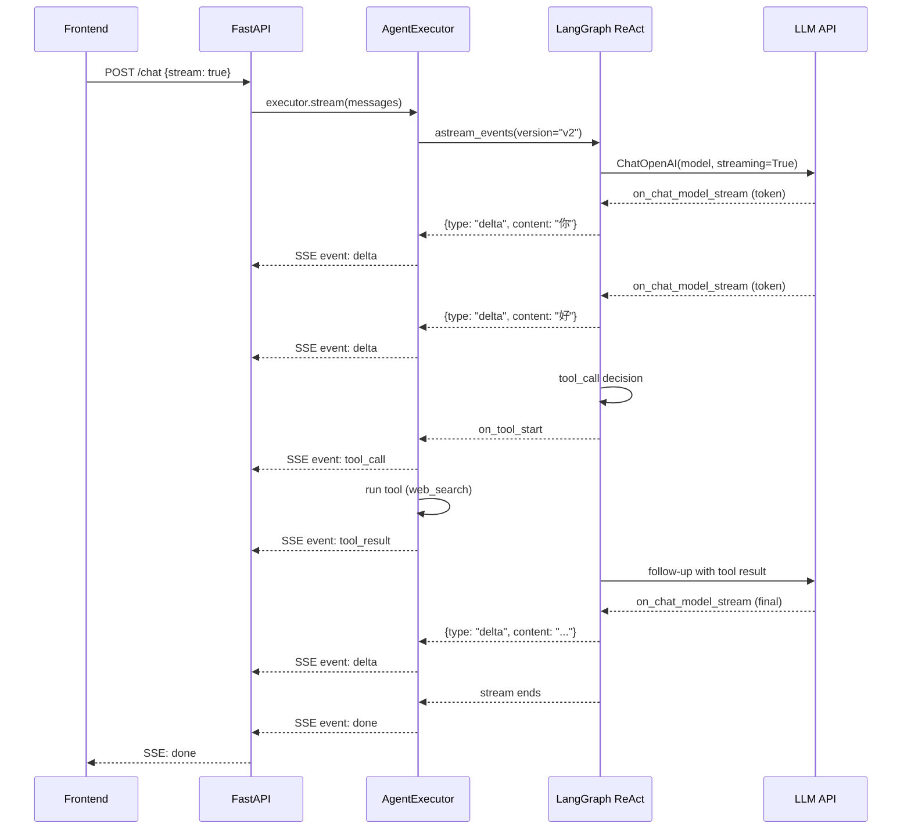

# X-Agent Platform

An open-source AI Agent platform for creating, managing, running, and integrating AI agents into external systems.

## Architecture



## API



## Chat Streaming Flow



- **Backend**: FastAPI + SQLAlchemy + LangGraph + SSE streaming
- **Frontend**: React 19 + Vite + TypeScript + shadcn/ui + Tailwind v4
- **Database**: PostgreSQL (prod) / SQLite (dev), auto-detected via `DATABASE_URL`
- **Agent Runtime**: LangGraph `create_react_agent` with tool calling and streaming
- **Model**: OpenAI-compatible API (DeepSeek, OpenAI, LiteLLM proxy, etc.)

## Quick Start

### Backend

```powershell
cd agent-platform
pip install -e .
$env:OPENAI_API_KEY="sk-your-key"
$env:OPENAI_API_BASE="https://api.deepseek.com/v1"
uvicorn app.main:app --port 8001
```

### Frontend

```powershell
cd agent-frontend
npm install
npm run dev
```

Open http://localhost:5173 to use the UI.

## Project Structure

```
agent-platform/          # Python/FastAPI backend
├── app/
│   ├── api/             # REST API routes
│   │   ├── agents.py    # Agent CRUD
│   │   ├── sessions.py  # Session management
│   │   ├── chat.py      # Streaming/non-streaming chat
│   │   └── tools.py     # Tool listing & MCP registration
│   ├── db/              # Database engine & session
│   ├── models/          # SQLAlchemy ORM models
│   ├── runtime/         # Core agent engine
│   │   ├── executor.py  # LangGraph ReAct agent
│   │   ├── manager.py   # Executor cache
│   │   ├── tools.py     # Tool registry & web_search
│   │   └── mcp_client.py# MCP protocol client
│   └── schemas/         # Pydantic request/response models
├── test_full.py         # Comprehensive integration test
├── Dockerfile
└── docker-compose.yml

agent-frontend/          # React/Vite frontend
├── src/
│   ├── components/
│   │   ├── AgentList.tsx
│   │   ├── AgentForm.tsx
│   │   ├── SessionPanel.tsx
│   │   ├── ToolPanel.tsx
│   │   └── ui/          # shadcn/ui primitives
│   ├── api/client.ts    # API client & SSE parser
│   ├── types/index.ts   # TypeScript interfaces
│   └── lib/utils.ts     # cn() utility
└── vite.config.ts
```

## Key Features

- **Agent CRUD** — Create, list, update, delete agents with configurable models and tools
- **Streaming Chat** — Real-time SSE streaming with per-token deltas, tool call logs
- **Tool Calling** — Built-in `web_search` tool + any MCP-compatible tool servers
- **MCP Protocol** — Register STDIO or SSE-based MCP servers, use their tools in agents
- **Session Management** — Persistent conversation history per agent
- **Multiple Models** — Per-agent model config; works with any OpenAI-compatible API
- **SQLite/PostgreSQL** — Zero-config SQLite for dev, PostgreSQL for production
